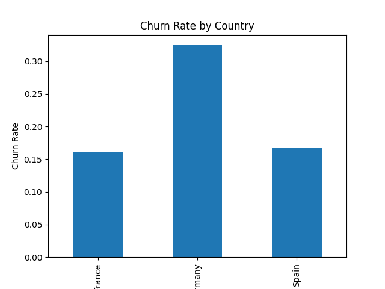

# Bank Customer Churn Analysis

## Project Overview
This project analyzes customer churn behavior and builds a machine learning model to predict which customers are likely to leave.

## Dataset
The dataset includes customer information such as:
- Credit score
- Age
- Balance
- Number of products
- Activity status
- Country

## Key Insights
- Customers who churn tend to be older.
- High-balance customers are more likely to leave.
- Inactive customers have a significantly higher churn rate.
- Germany shows the highest churn among all countries.

## Model
A Logistic Regression model was used to predict churn.

## Results
- Accuracy: ~81%
- The model performs well overall but struggles to identify churned customers (low recall).

## Recommendations
- Improve customer engagement to reduce churn.
- Focus on retaining high-value customers.
- Investigate regional issues in Germany.
- Improve the model using advanced techniques or handling class imbalance.

## Project Structure
- notebooks/ → Jupyter notebook with full analysis and model

## 📊 Churn Rate by Country

Germany shows a significantly higher churn rate (~32%) compared to other countries (~16%).
